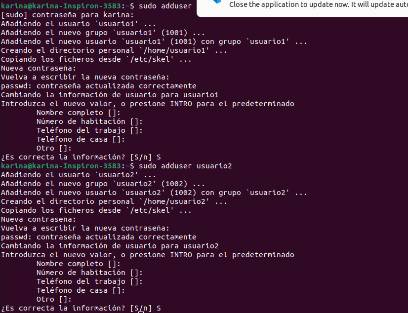
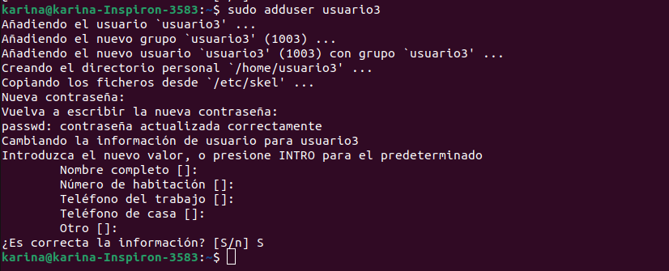
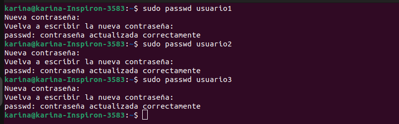
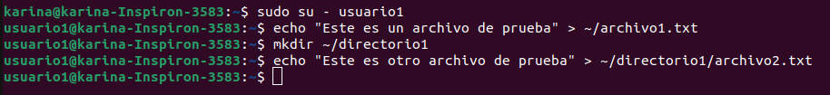
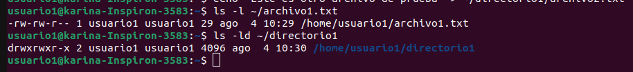

# Actividad 3: Administración de Usuarios, Grupos y Permisos en Linux

## Parte 1: Gestión de Usuarios

### 1. Creación de Usuarios

### 2. Asignacion de Contraseas

### 3. Informacion de Usuarios y 4. Eliminacion de Usuario

## Parte 2: Gestion de Grupos

### 1. Creacion de Grupos

### 2. Agregar Usuarios a Grupos

### 3. Verificar Membresia 

### 4. Eliminar Grupo 

## Parte 3: Gestion de Permisos

### 1. Creacion de Archivos y Directorios

### 2. Verificar Permisos

### 3. Modificar Permisos usando 'chmod' con modo numerico y 4. Modificar Permisos usando 'chmod' con modo simbolico

### 5. Cambiar el grupo propietario y 6. Configurar Permisos de Directorio

### 7. Comprobacion de Acceso

### 8. Verificacion Final

## Reflexion

### 1. ¿Por qué es importante gestionar correctamente los usuarios y permisos en un sistema operativo?

Gestionar usuarios y permisos es crucial para mantener la seguridad, proteger la privacidad de los datos y asegurar que solo personas autorizadas tengan acceso a la información y recursos importantes.

### 2. ¿Qué otros comandos o técnicas conocen para gestionar permisos en Linux?

Otros comandos útiles son chown para cambiar propietarios, chgrp para cambiar grupos,

