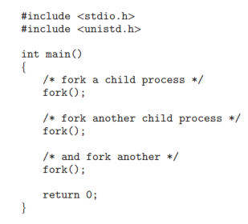
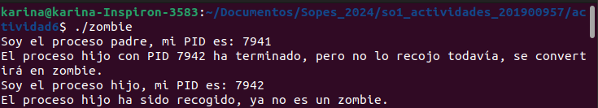
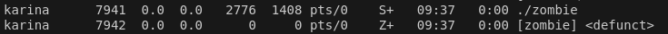

# Actividad 6
## Karina Ramirez 201900957
### 1. ¿Incluyendo el proceso inicial, cuantos procesos son creados por el siguiente programa? Razone su respuesta. 



#### Incluyendo el proceso original, el numero total de procesos creados por el programa es 8, ya que cada vez que se llama a ```fork()```, el proceso original se duplica y ambos procesos continuan ejecutando el codigo desde la linea inmediatamente despues de la llamada a ```fork()```.

### 2.Utilizando un sistema Linux, escriba un programa en C que cree un proceso hijo (fork) que finalmente se convierta en un proceso zombie. Este proceso zombie debe permanecer en el sistema durante al menos 60 segundos. Los estados del proceso se pueden obtener del comando: ps -l

#### Codigo zombie.c
```c
#include <stdio.h>
#include <stdlib.h>
#include <unistd.h>
#include <sys/wait.h>

int main() {
    pid_t pid = fork();  // Crear un proceso hijo

    if (pid < 0) {
        // Error al crear el proceso
        perror("fork failed");
        exit(1);
    } 
    if (pid == 0) {
        // Código del proceso hijo
        printf("Soy el proceso hijo, mi PID es: %d\n", getpid());
        exit(0);  // El proceso hijo termina inmediatamente (esto lo convierte en zombie)
    } else {
        // Código del proceso padre
        printf("Soy el proceso padre, mi PID es: %d\n", getpid());
        printf("El proceso hijo con PID %d ha terminado, pero no lo recojo todavía, se convertirá en zombie.\n", pid);
        
        // Pausar el proceso padre para que no recoja al hijo inmediatamente (crea el estado zombie)
        sleep(60);

        // Ahora, después de 60 segundos, recogemos al proceso hijo
        wait(NULL);  // Recoger al proceso hijo y eliminar el zombie
        printf("El proceso hijo ha sido recogido, ya no es un zombie.\n");
    }

    return 0;
}
```
#### Resultado 
#### Mensaje durante y despues de ejecutar el programa

#### Mensaje al ejecutar ps -l durante la ejecucion del programa


### 3. Usando el siguiente código como referencia, completar el programa para que sea ejecutable y responder las siguientes preguntas:
###     • ¿Cuántos procesos únicos son creados?
###     • ¿Cuántos hilos únicos son creados?

#### Codigo completado
```c
#include <stdio.h>
#include <stdlib.h>
#include <unistd.h>
#include <pthread.h>

void* thread_function(void* arg) {
    printf("Soy un hilo en el proceso con PID: %d\n", getpid());
    pthread_exit(NULL);
}

int main() {
    pid_t pid;

    pid = fork();

    if (pid < 0) {
        perror("fork failed");
        exit(1);
    }

    if (pid == 0) {
        printf("Soy el proceso hijo, mi PID es: %d\n", getpid());

        fork();

        pthread_t thread;
        pthread_create(&thread, NULL, thread_function, NULL);
        pthread_join(thread, NULL); 
    }

    
    fork();

    printf("Proceso con PID: %d finaliza.\n", getpid());
    sleep(1);  

    return 0;
}
```

#### Respuestas a la pregunta
1. Primera llamada a fork(): Crea 1 proceso (el hijo), lo que da un total de 2 procesos (padre + hijo).
Segunda llamada a fork() en el hijo: Este fork() solo se ejecuta en el proceso hijo, creando otro proceso (el nieto), lo que da un total de 3 procesos.
Tercera llamada a fork(): Esta llamada se ejecuta en los procesos que han llegado hasta este punto (padre, hijo, y nieto). Cada uno de ellos crea un nuevo proceso. Por lo tanto, se crean 3 procesos adicionales, lo que da un total de 6 procesos.
#### Total de procesos creados: 6.

2. Solo el proceso hijo crea un hilo con pthread_create(). Este hilo es único y no se replica con los fork().
#### Total de hilos creados: 1.