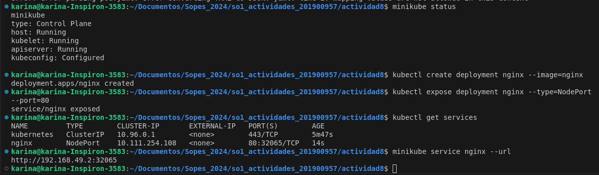
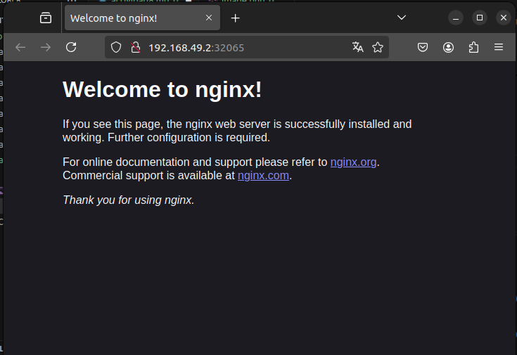

# ACTIVIDAD 8: Configuración Local de Kubernetes 
## Instalar un ambiente local de Kubernetes utlizando minikube, kind o Docker Desktop.
### Paso 1: Instalar un ambiente local de kubernetes en este caso utilizando Minikube 
#### Preparacion del sistema para la instalacion de software desde fuentes seguras
En la terminal ejecutaremos los siguientes comandos 
```bash
sudo apt update
sudo apt install -y apt-transport-https ca-certificates curl
```
#### Descargar e instalar Minikube:
Se ejecutaron los siguientes comando para descargar e instalar Minikube:
```bash
curl -LO https://storage.googleapis.com/minikube/releases/latest/minikube-linux-amd64
sudo install minikube-linux-amd64 /usr/local/bin/minikube
```
#### Iniciar Minikube:
Solo se ejecuto de la siguiente manera:
```bash
minikube start
```
#### Verificacion
Para comprobar que Minikube este funcionando correctamente ejecutamos el siguiente comando:
```bash
minikube status
```
### Paso 2: Desplegar un contenedor de algun web server, apache o nginx por ejemplo, en el Cluster de K8s Local.
Usaremos kubectl como linea de comandos para nuestro cluster de kubernetes que creo Minikube
#### Descarga e instalacion de kubectl
Para descargar e instalar kubectl se usaron los siguientes comandos:
```bash
curl -LO "https://storage.googleapis.com/kubernetes-release/release/$(curl -s https://storage.googleapis.com/kubernetes-release/release/stable.txt)/bin/linux/amd64/kubectl"
chmod +x kubectl
sudo mv kubectl /usr/local/bin/
```
#### Verificacion 
Para comprobar la correcta instalacion se usa el siguiente comando
```bash
kubectl version --client
```
#### Crear un Deployment de NGINX
mientras Minikube se encuentra activo utilizamos el siguiente comandos
```bash
kubectl create deployment nginx --image=nginx
```
#### Exponer el Deployment como servicio
```bash
kubectl expose deployment nginx --type=NodePort --port=80
```
#### Obtener la URL de NGINX
```bash
minikube service nginx --url
```
con la url que aparece accedemos a la aplicacion NGINX desde el navegador
#### pruebas de lo realizado
1. comandos usados para crear y exponer el Deployment y accedes a NGINX


2. aplicacion NGINX a la que accedimos desde el url


### 3. ¿En un ambiente local de Kubernetes existen los nodos masters y workers, como es que esto funciona?
En un ambiente local de Kubernetes, como en Minikube, un único nodo desempeña ambos roles, master y worker. Aunque funcionalmente se distingue entre ellos, no hay nodos físicos separados. Minikube combina estas funcionalidades en un solo nodo, lo cual es práctico para pruebas y desarrollo en local.


